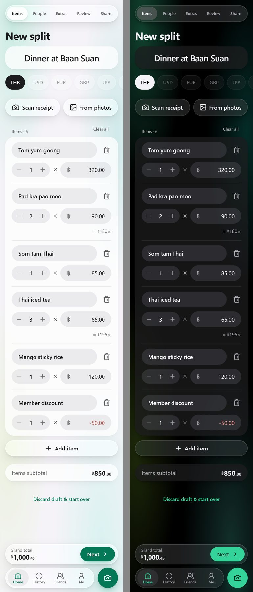
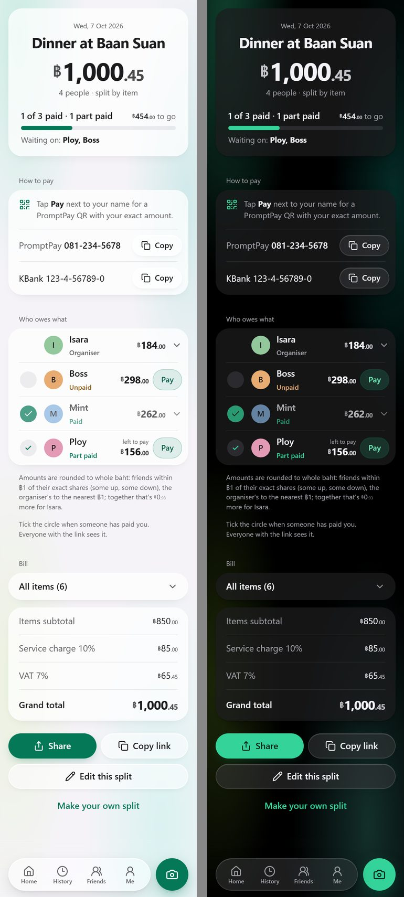

# Bill Splitter

Split a restaurant bill with friends in Thailand: scan the receipt, tick who had what, share one link, and see who has paid. PromptPay QR codes, transfer-slip checking, "big bills" for a whole night out, and an iOS-style "Liquid Glass" look in light and dark.

**Live:** https://billsplitter-th.vercel.app

<p>
  
  
</p>

More screenshots (light | dark) in [`docs/screenshots`](docs/screenshots).

## Features

**Making a split**
- **Scan a receipt** (Thai or English) with Gemini: items, quantities, per-item discounts, receipt-wide discount, service charge, VAT, the date (Buddhist-era years converted) and the shop's name as the title. Service charge, VAT and any "rounding / ปัดเศษ" line are used exactly as printed, so the total matches the receipt. Warns when the items don't add up to the printed total.
- **Split equally or by item.** Items can be shared unevenly ("Mint had 2 of the 3 beers") or split into separate lines ("2× Water" → two bottles shared by different people).
- **Discount, service charge, VAT** (off by default), and **round to whole baht**: friends pay whole amounts and together never less than their exact shares, so the organiser never loses money. With "split equally", everyone's share is the same whole amount.
- **Several payers:** a friend who paid part of the bill (e.g. the drinks) either settles with you (pays that much less, or gets money back), or everyone pays each payer directly: the app works out the fewest transfers ("Ploy → Mint ฿150"), each with the payer's own PromptPay QR, its own tick and slip check.
- **Bill date** with the app's own calendar (defaults to today; a scanned receipt sets it).
- **Friends and groups** saved on the phone; "Who's eating with you?" and "Same as last time" pick them quickly.

**Sharing and getting paid**
- **One link per bill**, with a link preview (title, total, people) that refreshes when the bill is edited.
- **PromptPay:** upload your bank's QR, or generate one from your PromptPay number with each person's exact amount. Bank details copy as just the account number.
- **Big tick / small tick:** the organiser marks people paid in full, paid part (with the amount; "left to pay" shows what's still owed), or not paid. The organiser is never counted as unpaid.
- **Transfer slips:** a friend uploads their slip; it's read with Gemini and checked (a transfer slip, dated on or after the bill, never used before; the receiver is matched by PromptPay number when the slip shows it) and they're ticked automatically, with a progress bar. The organiser can look over every slip.
- **Big bills:** combine several bills from one outing (Food 1, Karaoke, Food 2) into one page with one total and one payment per friend. Payments are spread over the bills; single bills can still be ticked on their own.
- **Receipt photo** on the shared page (zoomable).

**History and the phone**
- **History**, newest bill date first, with big bills holding their bills; tap a person to see their splits and what they owe you (or you owe them). Tap yourself to see what you spent.
- **Friends** page: tap a friend to see their splits. Renaming a friend (or yourself) updates the bills you've shared.
- **Backup and restore** (Me page) to move splits, friends and edit rights to a new phone.

## Tech

Next.js 16 (App Router) · React 19 · TypeScript · Tailwind CSS v4 · Redis (Redis Cloud over TCP, or Upstash REST) · Vercel Blob · Google Gemini (REST) · Vitest. Hosted on Vercel.

## Running it

```bash
npm install
npm run dev              # http://localhost:3000  (add `-- -H 0.0.0.0` to open it from a phone on the same Wi-Fi)
npm test                 # Vitest: money maths, rounding, scan clean-up, slips, big bills, PromptPay, backup…
npm run lint
npm run build
```

Without Redis/Blob settings, `npm run dev` uses in-memory stores, so sharing and uploads work locally (lost on restart). Without `GEMINI_API_KEY`, scanning says it isn't set up and items are added by hand.

Scripts:

```bash
node scripts/scan-reliability.mts [--url …] [--image receipt.jpg] [--n 10] [--gap 5]   # success rate + timing of /api/scan
node scripts/smoke-prod.mts https://billsplitter-th.vercel.app [receipt.jpg]          # live end-to-end check
```

## Environment variables

| Name | What it's for | Required |
| --- | --- | --- |
| `REDIS_URL` | Redis over TCP (e.g. Redis Cloud from the Vercel Marketplace) | one Redis option in production |
| `KV_REST_API_URL`, `KV_REST_API_TOKEN` | Upstash Redis over REST instead (`UPSTASH_REDIS_REST_*` also accepted) | one Redis option in production |
| `BLOB_STORE_ID` or `BLOB_READ_WRITE_TOKEN` | Vercel Blob for QR images, receipt photos and slips (`BLOB_STORE_ID` uses Vercel's automatic OIDC token) | for uploads |
| `GEMINI_API_KEY` | Receipt scanning and slip reading — https://aistudio.google.com/apikey (server only) | for scanning |
| `GEMINI_MODELS` | Comma-separated model list to use instead of the built-in chain | no |
| `NEXT_PUBLIC_SITE_URL` | Absolute site URL for link previews on a custom domain | no |
| `CRON_SECRET` | Lets only Vercel Cron run the daily photo clean-up | no |

## How it works

- **Several payers** — `src/lib/settle.ts`: what each person paid at the table minus their share, then the fewest transfers (largest debts to largest credits). Transfer payments are recorded under `t:{from}:{to}` keys; History and big bills use each friend's money with the organiser.
- **Maths** — `src/lib/calc.ts`, pure and integer-only (satang). Items → discount → service charge on the discounted subtotal → VAT on (subtotal + service). Shares use largest-remainder allocation, so everyone's amounts always add up exactly; uneven shares are weights on the same allocation. Rounding, paid-upfront and the organiser's share are applied on top, never letting the organiser lose money.
- **Scanning** — the phone fixes the photo's rotation and sends a ~2048 px JPEG to `POST /api/scan`. `src/lib/server/gemini.ts` races a chain of Gemini models (best first: 3.8 Flash, 3.7 Flash, 3.6 Flash, 3.5 Flash, 3.5 Flash-Lite, 3.1 Flash-Lite): the two best start together, others join when one fails or is slow, the first good answer wins. Busy, out-of-quota or timed-out models cool down (shared via Redis). Strict JSON schema, temperature 0, lowest thinking level. Results go through `src/lib/scanFilter.ts` and `applyScan`. See [`docs/scan-reliability.md`](docs/scan-reliability.md).
- **Sharing** — `POST /api/splits` → `{ id, token }`; only a SHA-256 of the edit token is stored. Splits live 90 days after the last activity. `/api/splits/{id}/paid` records payments (full, part or none; organiser only). Shared links carry `?v=` so chat apps refresh their preview after an edit; preview images come from `/api/og/s|e/{id}`.
- **Slips** — `POST /api/splits/{id}/slip` (and `/api/events/{id}/slip`): read with Gemini, checked by `src/lib/slip.ts`, each slip reference can be used once.
- **Big bills** — `/api/events`: a title, a date and a list of bills you own (checked with their edit tokens); `src/lib/event.ts` merges people across the bills and spreads payments.
- **Storage** — the phone keeps History, friends, groups, edit tokens and the draft in `localStorage` (backup/restore on the Me page). The server keeps splits, payments, big bills, slip records and model cool-downs in Redis, and pictures in Vercel Blob. A daily Vercel Cron job deletes receipt photos no split uses and old slip pictures.
- All API routes are validated (zod) and rate limited per IP.

## Deploying

The repo is connected to Vercel: pushing to `main` deploys production (https://billsplitter-th.vercel.app); other branches get preview deployments. Check a deploy with `node scripts/smoke-prod.mts https://billsplitter-th.vercel.app`.
